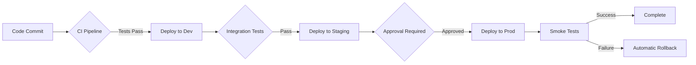

# Enterprise Project Onboarding Guide

**Version:** 1.0  
**Last Updated:** December 19, 2025  
**Owner:** Platform Engineering Team

---

## Table of Contents
- [Overview](#overview)
- [Prerequisites](#prerequisites)
- [Onboarding Process](#onboarding-process)
- [Team Structure](#team-structure)
- [Access Management](#access-management)
- [Environment Provisioning](#environment-provisioning)
- [Cost Management](#cost-management)
- [Security & Compliance](#security--compliance)
- [Support & Escalation](#support--escalation)

---

## Overview

This guide walks through onboarding a new project team onto the enterprise Azure platform with proper governance, security, and cost controls.

### Enterprise Architecture

```
┌─────────────────────────────────────────────────────────────────┐
│                         Azure Active Directory                   │
│  Groups, RBAC, Conditional Access, Privileged Identity Mgmt     │
└──────────────────────────┬──────────────────────────────────────┘
                           │
        ┌──────────────────┴───────────────────┐
        │                                      │
┌───────▼────────┐                   ┌────────▼────────┐
│   Foundation   │                   │    Projects     │
│  Subscription  │                   │  Subscriptions  │
├────────────────┤                   ├─────────────────┤
│ • Hub Network  │◄──────Peering────►│ Project Alpha   │
│ • Firewall     │                   │ Project Beta    │
│ • Bastion      │                   │ Project Gamma   │
│ • Log Analytics│◄──────Logs────────┤ Shared Services │
│ • Key Vault    │                   └─────────────────┘
│ • Security Ctr │
└────────────────┘
```

### Key Principles

1. **Self-Service with Guardrails** - Teams deploy autonomously within policy boundaries
2. **Security by Default** - All resources deployed with security baseline
3. **Observable by Design** - Centralized logging and monitoring mandatory
4. **Cost Transparency** - Real-time cost visibility per project/team
5. **Compliance First** - Automated policy enforcement

---

## Prerequisites

### For New Project Teams

Before onboarding, ensure you have:

- [ ] **Project Charter** - Business justification, scope, timeline
- [ ] **Team Roster** - List of team members with roles
- [ ] **Cost Budget** - Approved monthly Azure spend limit
- [ ] **Compliance Requirements** - SOC2, HIPAA, PCI-DSS, etc.
- [ ] **Network Requirements** - IP ranges, connectivity needs
- [ ] **Data Classification** - Public, Internal, Confidential, Restricted

### For Platform Team

- [ ] Azure AD Premium P2 license
- [ ] Azure Subscriptions (Foundation + Project-specific)
- [ ] GitHub Enterprise or Azure DevOps
- [ ] ServiceNow or similar ITSM tool
- [ ] Cost management tools configured

---

## Onboarding Process

### Phase 1: Project Registration (Day 1)

**Duration:** 1-2 hours  
**Owner:** Platform Team

#### 1.1 Create Project Record

```bash
# Create project in tracking system
PROJECT_NAME="project-alpha"
PROJECT_CODE="ALPHA"
COST_CENTER="CC-12345"
BUSINESS_OWNER="jane.doe@company.com"
TECHNICAL_LEAD="john.smith@company.com"

# Record in project database
curl -X POST https://platform-api.company.com/projects \
  -H "Content-Type: application/json" \
  -d '{
    "name": "'$PROJECT_NAME'",
    "code": "'$PROJECT_CODE'",
    "costCenter": "'$COST_CENTER'",
    "businessOwner": "'$BUSINESS_OWNER'",
    "technicalLead": "'$TECHNICAL_LEAD'",
    "environments": ["dev", "staging", "prod"]
  }'
```

#### 1.2 Generate Naming Convention

Based on enterprise standards:

```
Resource Naming Pattern:
{company}-{env}-{project}-{resource}-{region}-{instance}

Examples:
- Resource Group:    acme-prod-alpha-rg-eastus-001
- AKS Cluster:       acme-prod-alpha-aks-eastus-001
- Key Vault:         acme-prod-alpha-kv-eus-001
- Storage Account:   acmeprodalphasteustus001 (no hyphens)
- Virtual Network:   acme-prod-alpha-vnet-eastus-001
```

#### 1.3 Allocate IP Address Space

```yaml
# IP Allocation (from enterprise IPAM)
project-alpha:
  dev:
    vnet: 10.100.0.0/20      # 4096 addresses
    subnets:
      aks: 10.100.0.0/22     # 1024 addresses
      app: 10.100.4.0/24     # 256 addresses
      data: 10.100.5.0/24    # 256 addresses
      mgmt: 10.100.6.0/27    # 32 addresses
  
  staging:
    vnet: 10.110.0.0/20
    # ... similar breakdown
  
  prod:
    vnet: 10.120.0.0/19      # Larger for production
    # ... similar breakdown
```

### Phase 2: Identity & Access Setup (Day 1-2)

**Duration:** 2-4 hours  
**Owner:** Security Team + Platform Team

#### 2.1 Create Azure AD Groups

```powershell
# Connect to Azure AD
Connect-AzureAD

$projectCode = "ALPHA"

# Create security groups
$groups = @(
    @{Name="SG-$projectCode-Owners"; Description="Project owners with full control"},
    @{Name="SG-$projectCode-Contributors"; Description="Project developers"},
    @{Name="SG-$projectCode-Readers"; Description="Read-only access"},
    @{Name="SG-$projectCode-DevOps"; Description="CI/CD service principals"},
    @{Name="SG-$projectCode-Data-Admins"; Description="Database administrators"},
    @{Name="SG-$projectCode-Security"; Description="Security reviewers"}
)

foreach ($group in $groups) {
    New-AzureADGroup `
        -DisplayName $group.Name `
        -MailEnabled $false `
        -SecurityEnabled $true `
        -MailNickName $group.Name `
        -Description $group.Description
    
    Write-Host "Created group: $($group.Name)"
}
```

#### 2.2 Assign Initial Members

```powershell
# Get groups
$ownerGroup = Get-AzureADGroup -Filter "DisplayName eq 'SG-$projectCode-Owners'"
$contribGroup = Get-AzureADGroup -Filter "DisplayName eq 'SG-$projectCode-Contributors'"

# Add business owner
$businessOwner = Get-AzureADUser -Filter "UserPrincipalName eq '$BUSINESS_OWNER'"
Add-AzureADGroupMember -ObjectId $ownerGroup.ObjectId -RefObjectId $businessOwner.ObjectId

# Add technical lead
$techLead = Get-AzureADUser -Filter "UserPrincipalName eq '$TECHNICAL_LEAD'"
Add-AzureADGroupMember -ObjectId $ownerGroup.ObjectId -RefObjectId $techLead.ObjectId
Add-AzureADGroupMember -ObjectId $contribGroup.ObjectId -RefObjectId $techLead.ObjectId

# Add team members (from roster)
$teamMembers = @("dev1@company.com", "dev2@company.com", "dev3@company.com")
foreach ($member in $teamMembers) {
    $user = Get-AzureADUser -Filter "UserPrincipalName eq '$member'"
    Add-AzureADGroupMember -ObjectId $contribGroup.ObjectId -RefObjectId $user.ObjectId
}
```

#### 2.3 Configure Conditional Access

```powershell
# Require MFA for all project access
# Restrict access from corporate network only
# Block legacy authentication

# This is typically done via Azure Portal or Graph API
# Example conditional access policy for the project
```

### Phase 3: Subscription & Resource Group Setup (Day 2)

**Duration:** 1-2 hours  
**Owner:** Platform Team

#### 3.1 Create Project Subscription (Enterprise Agreement)

```powershell
# For EA customers with subscription creation rights
# Alternatively, use existing subscription with resource groups

Connect-AzAccount

# Create subscription (if authorized)
$subscriptionName = "SUB-Project-Alpha"
# New-AzSubscription -Name $subscriptionName -EnrollmentAccountObjectId <EA_ACCOUNT_ID>

# Or use existing subscription
$subscriptionId = "12345678-1234-1234-1234-123456789012"
Set-AzContext -SubscriptionId $subscriptionId
```

#### 3.2 Create Resource Groups per Environment

```powershell
$project = "alpha"
$company = "acme"
$location = "eastus"

$environments = @("dev", "staging", "prod")

foreach ($env in $environments) {
    $rgName = "$company-$env-$project-rg-$location-001"
    
    New-AzResourceGroup `
        -Name $rgName `
        -Location $location `
        -Tag @{
            Environment = $env
            Project = $project
            CostCenter = $COST_CENTER
            BusinessOwner = $BUSINESS_OWNER
            TechnicalLead = $TECHNICAL_LEAD
            ManagedBy = "Terraform"
            CreatedDate = (Get-Date -Format "yyyy-MM-dd")
        }
    
    Write-Host "Created resource group: $rgName"
}
```

#### 3.3 Assign RBAC Permissions

```powershell
# Function to assign RBAC
function Set-ProjectRBAC {
    param(
        [string]$ResourceGroupName,
        [string]$Environment
    )
    
    $ownerGroup = Get-AzADGroup -DisplayName "SG-$projectCode-Owners"
    $contribGroup = Get-AzADGroup -DisplayName "SG-$projectCode-Contributors"
    $readerGroup = Get-AzADGroup -DisplayName "SG-$projectCode-Readers"
    
    $rg = Get-AzResourceGroup -Name $ResourceGroupName
    
    # Owners get full control in all environments
    New-AzRoleAssignment `
        -ObjectId $ownerGroup.Id `
        -RoleDefinitionName "Owner" `
        -ResourceGroupName $ResourceGroupName
    
    # Contributors in dev/staging, Reader in prod
    if ($Environment -eq "prod") {
        New-AzRoleAssignment `
            -ObjectId $contribGroup.Id `
            -RoleDefinitionName "Reader" `
            -ResourceGroupName $ResourceGroupName
    } else {
        New-AzRoleAssignment `
            -ObjectId $contribGroup.Id `
            -RoleDefinitionName "Contributor" `
            -ResourceGroupName $ResourceGroupName
    }
    
    # Readers get read-only access everywhere
    New-AzRoleAssignment `
        -ObjectId $readerGroup.Id `
        -RoleDefinitionName "Reader" `
        -ResourceGroupName $ResourceGroupName
}

# Apply RBAC to all environments
foreach ($env in $environments) {
    $rgName = "$company-$env-$project-rg-$location-001"
    Set-ProjectRBAC -ResourceGroupName $rgName -Environment $env
}
```

### Phase 4: Network Provisioning (Day 2-3)

**Duration:** 2-4 hours  
**Owner:** Network Team

#### 4.1 Deploy Project VNets

```hcl
# Terraform configuration for project network
# enterprise/projects/project-alpha/network/main.tf

module "project_network" {
  source = "../../../foundation/networking/modules/spoke-network"
  
  project_name = "alpha"
  environment  = var.environment
  location     = "eastus"
  
  vnet_address_space = var.vnet_address_space
  subnets = {
    aks = {
      address_prefix = var.aks_subnet_prefix
      service_endpoints = ["Microsoft.Storage", "Microsoft.KeyVault", "Microsoft.Sql"]
    }
    app = {
      address_prefix = var.app_subnet_prefix
      service_endpoints = ["Microsoft.Storage", "Microsoft.Sql"]
    }
    data = {
      address_prefix = var.data_subnet_prefix
      service_endpoints = ["Microsoft.Sql", "Microsoft.Storage"]
      delegation = {
        name         = "sql-delegation"
        service_name = "Microsoft.Sql/managedInstances"
      }
    }
  }
  
  # Peer to hub network
  hub_vnet_id = data.azurerm_virtual_network.hub.id
  
  tags = local.common_tags
}
```

#### 4.2 Establish VNet Peering to Hub

```powershell
# Peer project spoke to hub network
$hubVnetId = "/subscriptions/<foundation-sub>/resourceGroups/acme-hub-network-rg/providers/Microsoft.Network/virtualNetworks/acme-hub-vnet"
$spokeVnetId = "/subscriptions/<project-sub>/resourceGroups/acme-dev-alpha-rg-eastus-001/providers/Microsoft.Network/virtualNetworks/acme-dev-alpha-vnet"

# Hub to Spoke
Add-AzVirtualNetworkPeering `
    -Name "hub-to-alpha-dev" `
    -VirtualNetwork (Get-AzVirtualNetwork -ResourceId $hubVnetId) `
    -RemoteVirtualNetworkId $spokeVnetId `
    -AllowForwardedTraffic `
    -AllowGatewayTransit

# Spoke to Hub
Add-AzVirtualNetworkPeering `
    -Name "alpha-dev-to-hub" `
    -VirtualNetwork (Get-AzVirtualNetwork -ResourceId $spokeVnetId) `
    -RemoteVirtualNetworkId $hubVnetId `
    -AllowForwardedTraffic `
    -UseRemoteGateways
```

#### 4.3 Configure DNS

```powershell
# Link project VNet to private DNS zones in hub
$privateDnsZones = @(
    "privatelink.database.windows.net",
    "privatelink.blob.core.windows.net",
    "privatelink.vaultcore.azure.net",
    "privatelink.azurecr.io"
)

foreach ($zone in $privateDnsZones) {
    New-AzPrivateDnsVirtualNetworkLink `
        -ResourceGroupName "acme-hub-dns-rg" `
        -ZoneName $zone `
        -Name "link-alpha-dev" `
        -VirtualNetworkId $spokeVnetId
}
```

### Phase 5: Security Baseline (Day 3)

**Duration:** 2-3 hours  
**Owner:** Security Team

#### 5.1 Deploy Azure Policy Assignments

```powershell
# Assign enterprise policies to project resource groups

$policies = @(
    @{Name="Require tags"; PolicyId="/providers/Microsoft.Authorization/policyDefinitions/require-tag"},
    @{Name="Allowed locations"; PolicyId="/providers/Microsoft.Authorization/policyDefinitions/allowed-locations"},
    @{Name="Require encryption"; PolicyId="/providers/Microsoft.Authorization/policyDefinitions/storage-encryption"},
    @{Name="Require HTTPS"; PolicyId="/providers/Microsoft.Authorization/policyDefinitions/https-only"},
    @{Name="Block public access"; PolicyId="/providers/Microsoft.Authorization/policyDefinitions/no-public-ip"}
)

foreach ($env in $environments) {
    $rgName = "$company-$env-$project-rg-$location-001"
    
    foreach ($policy in $policies) {
        New-AzPolicyAssignment `
            -Name "$($policy.Name)-$env" `
            -PolicyDefinition (Get-AzPolicyDefinition -Id $policy.PolicyId) `
            -Scope "/subscriptions/$subscriptionId/resourceGroups/$rgName"
    }
}
```

#### 5.2 Configure Security Center

```powershell
# Enable Microsoft Defender for Cloud
Set-AzSecurityPricing `
    -Name "VirtualMachines" `
    -PricingTier "Standard"

Set-AzSecurityPricing `
    -Name "SqlServers" `
    -PricingTier "Standard"

Set-AzSecurityPricing `
    -Name "AppServices" `
    -PricingTier "Standard"

Set-AzSecurityPricing `
    -Name "StorageAccounts" `
    -PricingTier "Standard"

Set-AzSecurityPricing `
    -Name "KubernetesService" `
    -PricingTier "Standard"

# Configure security contacts
Set-AzSecurityContact `
    -Name "default1" `
    -Email "security@company.com" `
    -Phone "+1-555-0100" `
    -AlertAdmin `
    -NotifyOnAlert
```

#### 5.3 Create Project Key Vault

```powershell
$kvName = "$company-$env-$project-kv-$location-001"

New-AzKeyVault `
    -VaultName $kvName `
    -ResourceGroupName $rgName `
    -Location $location `
    -EnableRbacAuthorization `
    -EnablePurgeProtection `
    -EnableSoftDelete `
    -SoftDeleteRetentionInDays 90 `
    -Tag @{
        Environment = $env
        Project = $project
    }

# Grant access to appropriate groups
$kvId = (Get-AzKeyVault -VaultName $kvName).ResourceId

# Owners = Key Vault Administrator
New-AzRoleAssignment `
    -ObjectId $ownerGroup.Id `
    -RoleDefinitionName "Key Vault Administrator" `
    -Scope $kvId

# Contributors = Key Vault Secrets Officer
New-AzRoleAssignment `
    -ObjectId $contribGroup.Id `
    -RoleDefinitionName "Key Vault Secrets Officer" `
    -Scope $kvId
```

### Phase 6: Monitoring & Logging (Day 3-4)

**Duration:** 2-3 hours  
**Owner:** Platform Team

#### 6.1 Link to Centralized Log Analytics

```powershell
# Get central Log Analytics workspace
$hubWorkspaceId = "/subscriptions/<foundation-sub>/resourceGroups/acme-hub-monitoring-rg/providers/Microsoft.OperationalInsights/workspaces/acme-hub-logs"

# Configure diagnostic settings for resource group resources
# This will be automated via policy
```

#### 6.2 Create Project-Specific Application Insights

```powershell
$appInsightsName = "$company-$env-$project-appinsights-$location-001"

New-AzApplicationInsights `
    -ResourceGroupName $rgName `
    -Name $appInsightsName `
    -Location $location `
    -WorkspaceResourceId $hubWorkspaceId `
    -Kind "web"
```

#### 6.3 Configure Alerts

```yaml
# Alert rules for project
alerts:
  - name: High CPU Usage
    severity: 2
    threshold: 80%
    window: 5m
    
  - name: Budget Alert
    severity: 1
    threshold: 80% of monthly budget
    
  - name: Security Alert
    severity: 0
    condition: Microsoft Defender findings
    
  - name: Availability Alert
    severity: 1
    threshold: < 99.9% uptime
```

### Phase 7: Cost Management (Day 4)

**Duration:** 1-2 hours  
**Owner:** FinOps Team

#### 7.1 Set Budget

```powershell
# Create monthly budget
$budgetName = "budget-$project-$env-monthly"
$amount = 5000  # USD per month

New-AzConsumptionBudget `
    -Name $budgetName `
    -Amount $amount `
    -Category Cost `
    -TimeGrain Monthly `
    -StartDate (Get-Date).Date `
    -ResourceGroupName $rgName `
    -ContactEmail @("finance@company.com", $TECHNICAL_LEAD) `
    -NotificationThreshold @(50, 80, 100, 110)
```

#### 7.2 Configure Cost Allocation Tags

```powershell
# Enforce tagging policy
$requiredTags = @{
    "CostCenter" = $COST_CENTER
    "Project" = $project
    "Environment" = $env
    "BusinessOwner" = $BUSINESS_OWNER
    "TechnicalLead" = $TECHNICAL_LEAD
}

# This is enforced via Azure Policy
```

#### 7.3 Setup Cost Anomaly Alerts

```powershell
# Configure cost anomaly detection
# Alert when spending exceeds 20% week-over-week
```

### Phase 8: CI/CD Setup (Day 4-5)

**Duration:** 3-4 hours  
**Owner:** DevOps Team

#### 8.1 Create Service Principal for Automation

```powershell
# Create SPN for Terraform/CI-CD
$spnName = "spn-$project-terraform"

$sp = New-AzADServicePrincipal `
    -DisplayName $spnName `
    -Role "Contributor" `
    -Scope "/subscriptions/$subscriptionId/resourceGroups/$rgName"

# Store credentials in central Key Vault
$BSTR = [System.Runtime.InteropServices.Marshal]::SecureStringToBSTR($sp.Secret)
$clientSecret = [System.Runtime.InteropServices.Marshal]::PtrToStringAuto($BSTR)

Set-AzKeyVaultSecret `
    -VaultName "acme-hub-automation-kv" `
    -Name "$project-spn-client-id" `
    -SecretValue (ConvertTo-SecureString $sp.ApplicationId -AsPlainText -Force)

Set-AzKeyVaultSecret `
    -VaultName "acme-hub-automation-kv" `
    -Name "$project-spn-client-secret" `
    -SecretValue (ConvertTo-SecureString $clientSecret -AsPlainText -Force)
```

#### 8.2 Create GitHub/Azure DevOps Project

```bash
# Create GitHub repository
gh repo create company/project-alpha-infrastructure --private

# Add secrets
gh secret set AZURE_CLIENT_ID --body "$($sp.ApplicationId)"
gh secret set AZURE_CLIENT_SECRET --body "$clientSecret"
gh secret set AZURE_SUBSCRIPTION_ID --body "$subscriptionId"
gh secret set AZURE_TENANT_ID --body "$tenantId"
```

#### 8.3 Deploy Terraform Backend

```powershell
# Create storage account for Terraform state
$stName = "${company}${env}${project}tfstate"

New-AzStorageAccount `
    -ResourceGroupName $rgName `
    -Name $stName `
    -Location $location `
    -SkuName "Standard_GRS" `
    -EnableHttpsTrafficOnly $true `
    -MinimumTlsVersion "TLS1_2" `
    -AllowBlobPublicAccess $false

# Create container
New-AzStorageContainer `
    -Name "tfstate" `
    -Context (Get-AzStorageAccount -ResourceGroupName $rgName -Name $stName).Context
```

### Phase 9: Documentation & Handoff (Day 5)

**Duration:** 2-3 hours  
**Owner:** Platform Team

#### 9.1 Generate Project Documentation

```markdown
# Project Alpha - Quick Start Guide

## Access
- Azure Portal: https://portal.azure.com
- Subscription: SUB-Project-Alpha (12345678-...)
- Resource Groups:
  - Dev: acme-dev-alpha-rg-eastus-001
  - Staging: acme-staging-alpha-rg-eastus-001
  - Prod: acme-prod-alpha-rg-eastus-001

## Azure AD Groups
- Owners: SG-ALPHA-Owners
- Contributors: SG-ALPHA-Contributors
- Readers: SG-ALPHA-Readers

## Network
- Dev VNet: 10.100.0.0/20
- Staging VNet: 10.110.0.0/20
- Prod VNet: 10.120.0.0/19
- Hub VNet: 10.0.0.0/16 (shared)

## Key Resources
- Key Vault: acme-dev-alpha-kv-eastus-001
- App Insights: acme-dev-alpha-appinsights-eastus-001
- Storage (TF State): acmedevalphatfstate

## Contacts
- Business Owner: jane.doe@company.com
- Technical Lead: john.smith@company.com
- Platform Support: platform-support@company.com
- Security: security@company.com

## Budget
- Monthly: $5,000
- Alerts: 50%, 80%, 100%, 110%

## Next Steps
1. Clone repository: company/project-alpha-infrastructure
2. Review terraform configuration
3. Deploy infrastructure via CI/CD
4. Configure applications
```

#### 9.2 Conduct Handoff Meeting

**Agenda:**
- Architecture walkthrough
- Access demonstration
- Cost dashboard review
- CI/CD pipeline demo
- Support processes
- Q&A

#### 9.3 Schedule Follow-ups

- **Week 1:** Daily check-ins
- **Week 2:** Every other day
- **Week 3-4:** Weekly
- **Month 2+:** Monthly project review

---

## Team Structure

### Roles & Responsibilities

| Role | Responsibilities | Azure AD Group | RBAC Role |
|------|-----------------|----------------|-----------|
| **Business Owner** | Budget approval, business decisions | SG-{PROJECT}-Owners | Owner |
| **Technical Lead** | Architecture, technical decisions | SG-{PROJECT}-Owners | Owner |
| **Developers** | Application development | SG-{PROJECT}-Contributors | Contributor (dev/staging), Reader (prod) |
| **DevOps Engineers** | CI/CD, infrastructure | SG-{PROJECT}-Contributors | Contributor |
| **Data Engineers** | Database, data pipelines | SG-{PROJECT}-Data-Admins | SQL DB Contributor |
| **Security Reviewer** | Security compliance | SG-{PROJECT}-Security | Security Reader |
| **Auditor** | Compliance audits | SG-{PROJECT}-Readers | Reader |

---

## Access Management

### Requesting Access

1. **Self-Service Portal:** https://access.company.com
2. **Fill Request Form:**
   - Project name
   - Role needed
   - Business justification
   - Duration (if temporary)
3. **Approval Workflow:**
   - Manager approval
   - Technical lead approval (for Owner/Contributor)
   - Security review (for production access)
4. **Provisioning:** Automatic via Azure AD group membership

### Removing Access

- **Automated:** User leaves company (terminated in HR system)
- **Manual:** Access review every 90 days
- **Emergency:** Immediate revocation via security team

### Privileged Access (Just-In-Time)

For production access:

```powershell
# Request JIT access (valid for 8 hours)
Request-JITAccess `
    -Project "alpha" `
    -Environment "prod" `
    -Role "Contributor" `
    -Duration 8 `
    -Justification "Emergency fix for ticket INC-12345"
```

---

## Environment Provisioning

### Standard Environments

| Environment | Purpose | SLA | Backup | Cost Tier |
|-------------|---------|-----|--------|-----------|
| **Sandbox** | Experimentation, POCs | None | None | Minimal |
| **Development** | Active development | 95% | Daily (7 days) | Low |
| **Staging** | Pre-production testing | 99% | Daily (30 days) | Medium |
| **Production** | Live production | 99.9% | Hourly (90 days) | High |

### Deployment Process



---

## Cost Management

### Cost Optimization Checklist

- [ ] Right-size VMs (use Azure Advisor recommendations)
- [ ] Use Reserved Instances for predictable workloads (save 30-50%)
- [ ] Enable auto-shutdown for dev/staging VMs
- [ ] Use Azure Hybrid Benefit for Windows/SQL licenses
- [ ] Implement autoscaling (scale to zero when possible)
- [ ] Use spot instances for batch workloads
- [ ] Archive old data to cool/archive storage tiers
- [ ] Delete unused resources (orphaned disks, old snapshots)

### Monthly Cost Review

Platform team provides:
- **Weekly:** Cost trend analysis
- **Monthly:** Detailed cost breakdown by resource
- **Quarterly:** Optimization recommendations

---

## Security & Compliance

### Security Baseline

All projects must implement:

1. **Identity:** Azure AD with MFA
2. **Network:** Private endpoints, no public IPs
3. **Encryption:** Data at rest and in transit
4. **Secrets:** Azure Key Vault (no hardcoded secrets)
5. **Monitoring:** Microsoft Defender enabled
6. **Logging:** All audit logs to central workspace
7. **Backup:** Automated, tested quarterly
8. **Patching:** Automated monthly

### Compliance Frameworks

Projects may require:

- **SOC 2 Type II:** Annual audit
- **HIPAA:** Healthcare data
- **PCI-DSS:** Payment card data
- **ISO 27001:** Information security
- **GDPR:** EU personal data

Platform team provides compliance templates and automation.

---

## Support & Escalation

### Support Channels

| Channel | Response Time | Use For |
|---------|---------------|---------|
| **Slack #platform-support** | 30 min | Questions, how-to |
| **ServiceNow Incident** | 1 hour | Service disruption |
| **ServiceNow Request** | 1 business day | New resources, access |
| **Emergency Hotline** | Immediate | Production down |

### Escalation Path

1. **L1:** Platform support team
2. **L2:** Senior platform engineers
3. **L3:** Platform architects
4. **L4:** Azure support (if needed)

### SLA Commitments

- **Critical (P0):** 15 min response, 1 hour resolution
- **High (P1):** 1 hour response, 4 hour resolution
- **Medium (P2):** 4 hour response, 1 day resolution
- **Low (P3):** 1 day response, 1 week resolution

---

## Appendix

### A. Naming Standards

See [NAMING-STANDARDS.md](./NAMING-STANDARDS.md)

### B. Network Topology

See [NETWORK-ARCHITECTURE.md](./NETWORK-ARCHITECTURE.md)

### C. Security Policies

See [SECURITY-POLICIES.md](./SECURITY-POLICIES.md)

### D. Disaster Recovery

See [DISASTER-RECOVERY.md](./DISASTER-RECOVERY.md)

### E. Runbooks

- [Incident Response](./runbooks/incident-response.md)
- [Backup & Restore](./runbooks/backup-restore.md)
- [Scaling Operations](./runbooks/scaling.md)
- [Security Incident](./runbooks/security-incident.md)

---

**Questions?** Contact platform-team@company.com
